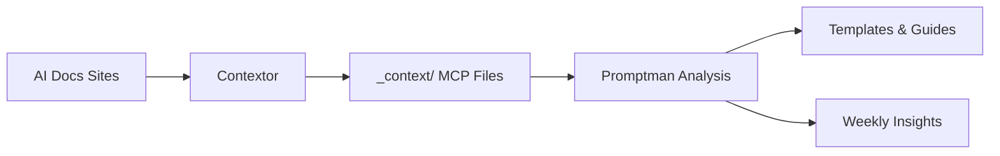

# Promptman

A specialized agent for prompt engineering analysis and synthesis. Promptman processes content from leading AI documentation sites to maintain curated best practices, templates, and insights for the prompt engineering community.

## Why Promptman?

- **Prompt Engineering Expertise**: Specialized focus on analyzing and synthesizing prompt engineering knowledge
- **Evidence-Based**: All recommendations backed by authoritative sources with clear citations
- **Contextor Integration**: Uses Contextor for reliable content acquisition, focuses on analysis
- **Quality Templates**: Maintains curated collection of high-quality prompt templates with examples
- **Automated Insights**: Weekly analysis of changes in prompt engineering guidance and best practices

## Quick Start

```bash
# Install dependencies
pip install promptman contextor

# Clone and setup
git clone https://github.com/<your-org>/promptman.git
cd promptman
pip install -r requirements.txt

# Configure environment
cp .env.example .env
# Add your OPENAI_API_KEY or ANTHROPIC_API_KEY

# Fetch latest content and analyze
contextor fetch --config config/targets.yaml
promptman analyze --date $(date +%F)
promptman synthesize

# Serve documentation
mkdocs serve
```

Visit [http://localhost:8000](http://localhost:8000) to explore the latest prompt engineering insights and templates.

## What You Get

### Curated Templates
- **System Prompts** - Role definition and behavior guidance
- **Few-Shot Examples** - Learning from examples techniques  
- **Chain of Thought** - Step-by-step reasoning patterns
- **Structured Output** - Formatting and schema compliance
- **Code Generation** - Programming assistance patterns

### Best Practice Documentation
- **Core Principles** - Fundamental prompt engineering concepts
- **Advanced Techniques** - Sophisticated prompting strategies
- **Evaluation Methods** - Assessing prompt effectiveness
- **Common Pitfalls** - What to avoid and why

### Weekly Insights
- **Change Analysis** - What's new in prompt engineering guidance
- **Pattern Recognition** - Emerging techniques and trends
- **Actionable Recommendations** - Concrete steps to improve your prompts

## Integration with Contextor

Promptman is designed to work seamlessly with Contextor:

1. **Contextor** fetches content from AI documentation sites → `_context/` directory
2. **Promptman** analyzes MCP files for prompt engineering insights
3. **Updates** are proposed via PR with evidence and rationale



## Popular Libraries Used

- **[Contextor](https://github.com/<your-org>/contextor)** - Content acquisition and MCP file generation
- **[OpenAI API](https://platform.openai.com/)** / **[Anthropic API](https://www.anthropic.com/)** - Content analysis and synthesis
- **[pandas](https://pandas.pydata.org/)** - Data analysis and processing
- **[scikit-learn](https://scikit-learn.org/)** - Optional clustering and pattern analysis
- **[MkDocs Material](https://squidfunk.github.io/mkdocs-material/)** - Beautiful documentation generation

## Architecture

Promptman consists of specialized roles:

- **Analyzer** - Detects changes in prompt engineering content
- **Synthesizer** - Generates insights and identifies patterns
- **Template Writer** - Updates and creates prompt templates
- **Docs Writer** - Maintains best practice documentation
- **Insight Writer** - Creates weekly summaries and recommendations

## Documentation

- **[Architecture](docs/architecture/)** - System design and principles
- **[Getting Started](docs/GETTING_STARTED.md)** - Detailed setup guide
- **[Core Principles](docs/core/)** - Prompt engineering fundamentals
- **[Templates](docs/templates/)** - Ready-to-use prompt templates
- **[Advanced Techniques](docs/techniques/)** - Sophisticated strategies

## Contributing

We welcome contributions to improve prompt engineering knowledge! Please see [CONTRIBUTING.md](CONTRIBUTING.md) for:

- How to contribute new templates or techniques
- Quality standards for submissions  
- Review and approval process

## License

MIT License - see [LICENSE](LICENSE) for details.

---

*Promptman is part of the Agent Engineering ecosystem. It uses [Contextor](https://github.com/<your-org>/contextor) for content acquisition and focuses exclusively on prompt engineering analysis and synthesis.*
